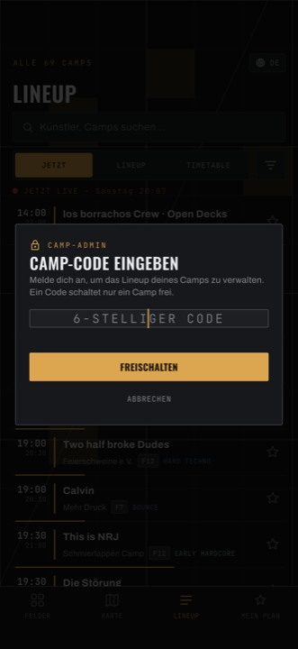

---
search:
  exclude: true
---

# Anmelden

## Die Anmeldung öffnen

Es gibt keinen sichtbaren Knopf. Der Zugang liegt hinter einer Geste auf dem
**Lineup**-Tab unten in der Leiste — eine von beiden reicht:

- **Den Lineup-Tab fünf Sekunden gedrückt halten.** Loslassen bricht ab.
- **Den Lineup-Tab zehnmal schnell hintereinander antippen** (jeder Tipp
  innerhalb einer halben Sekunde nach dem vorigen).

Beim Tippen sieht es aus, als passiere nichts — jeder Tipp wechselt einfach zum
Lineup-Tab. Zählt trotzdem mit und tippt weiter.

!!! danger "Dieselbe Geste meldet euch auch wieder ab"

    Seid ihr **bereits angemeldet**, öffnet die Geste nicht die Anmeldung —
    sie **meldet euch ab**. Und ein nicht veröffentlichter Entwurf ist dann
    ohne Nachfrage weg.

    Wenn ihr also unsicher seid, ob ihr noch angemeldet seid: nicht die Geste
    benutzen. Schaut stattdessen auf euer Camp — steht dort unten die Leiste
    mit **ABBRECHEN / SPEICHERN & VERÖFFENTLICHEN**, seid ihr drin.

## Den Code eingeben

<figure markdown>
  { .shot }
  <figcaption>Die Anmeldung legt sich über den Bildschirm, auf dem ihr gerade wart.</figcaption>
</figure>

> **CAMP-ADMIN**
> **CAMP-CODE EINGEBEN**
> Melde dich an, um das Lineup deines Camps zu verwalten. Ein Code schaltet nur
> ein Camp frei.
>
> `6-STELLIGER CODE`
>
> [ **FREISCHALTEN** ] [ ABBRECHEN ]

Das Feld schreibt automatisch groß — Klein- oder Großschreibung ist egal. Die
Eingabetaste eurer Tastatur wirkt wie **FREISCHALTEN**.

Klappt es, schließt sich die Karte und **euer Camp öffnet sich direkt im
Bearbeiten-Modus**.

## Wenn es nicht klappt

| Meldung | Bedeutung |
| --- | --- |
| **UNGÜLTIGER CODE** | Der Code stimmt nicht. Tippfehler? Achtet auf `0`/`O` und `1`/`I` — die kommen in echten Codes gar nicht vor. |
| **ANMELDUNG FEHLGESCHLAGEN** | Der Code kam nicht bis zum Server. Netzproblem, WLAN mit Anmeldeseite, oder es hat zu lange gedauert. Gleicher Code, nochmal probieren. |

Der Unterschied ist nützlich: **ungültig** heißt „falscher Code",
**fehlgeschlagen** heißt „schlechtes Netz". Bei Letzterem lohnt das Warten,
nicht das Suchen nach dem richtigen Code.

Die Meldung verschwindet, sobald ihr weitertippt.

## Woran ihr seht, dass ihr drin seid

Auf **eurem** Camp — und nur dort:

- Unten sitzt eine Leiste mit **ABBRECHEN**, **SPEICHERN & VERÖFFENTLICHEN**
  und darunter **ABMELDEN**.
- Der Reiter **Timetable** zeigt den Slot-Editor statt der Leseansicht.
- Der Reiter **Lineup** zeigt den DJ-Editor.

Auf allen anderen Camps seht ihr weiterhin die normale Leseansicht. Das ist
richtig so: euer Code gehört zu genau einem Camp.

## Abmelden

Drei Wege:

1. **ABMELDEN** unten in der Leiste. Ihr bleibt auf dem Camp, es wird nur wieder
   schreibgeschützt.
2. Die versteckte Geste noch einmal.
3. Die App komplett schließen.

!!! warning

    **Kein einziger dieser Wege fragt nach, ob ihr einen unveröffentlichten
    Entwurf habt.** Erst veröffentlichen, dann abmelden.
