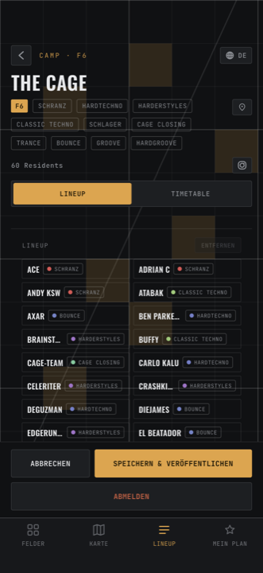

---
search:
  exclude: true
---

# Lineup pflegen

Der Reiter **Lineup** auf eurem Camp: die Liste eurer DJs. Sie ist die Vorlage,
aus der ihr beim Besetzen von Slots auswählt — und das, was Besucher:innen als
„wer gehört zu diesem Camp" sehen.

<figure markdown>
  { .shot }
  <figcaption>Eure DJs, zweispaltig — darunter Genre-Auswahl und Namensfeld.</figcaption>
</figure>

## Einen DJ hinzufügen

1. Reiter **Lineup**.
2. Optional ein **Genre** aus der Chip-Reihe wählen (nur eins; nochmal antippen
   hebt die Wahl auf).
3. Den Namen in das Feld **DJ-Name** tippen.
4. **DJ HINZUFÜGEN**.

Der Name wird großgeschrieben gespeichert.

!!! note "Zwei Fälle, in denen scheinbar nichts passiert"

    Ist das Feld **leer** oder gibt es den Namen **schon** (Groß-/Kleinschreibung
    egal), macht der Knopf nichts — ohne Meldung. Das Feld leert sich einfach.
    Das ist kein Fehler, sondern der Duplikat-Schutz.

## Einen DJ entfernen

1. Die Zeile **antippen**, sodass sie einen bernsteinfarbenen Rand bekommt.
2. **ENTFERNEN** oben rechts.

Steht neben dem Knopf blass **Zuerst ausplanen** und der Knopf reagiert nicht,
ist diese Person noch für mindestens ein Set eingeplant — an irgendeinem Tag,
auch als B2B-Partner:in.

**So löst ihr das:**

1. Reiter **Timetable**. Sucht alle Sets mit dieser Person — es können mehrere
   Tage sein.
2. Pro Set entweder das **✕** auf der Karte (macht den Slot frei), oder
   **⋯ → Künstler tauschen**, oder **⋯ → Slot entfernen**.
3. Zurück zum Reiter **Lineup**: die Zeile trägt jetzt einen bernsteinfarbenen
   Punkt — das heißt *nicht eingeplant*.
4. Zeile auswählen, **ENTFERNEN**.

!!! tip "Der Punkt verrät den Stand"

    **Bernsteinfarbener Punkt** = an keinem Tag eingeplant. Kein Punkt = spielt
    irgendwo. Diesen Punkt sehen nur ihr, Besucher:innen nicht.

## Namen, die von selbst auftauchen

Habt ihr beim Besetzen eines Slots einen Namen frei eingetippt, statt ihn aus
dem Roster zu wählen, wandert er beim **Veröffentlichen** automatisch in diese
Liste. Nach dem Veröffentlichen ist das Roster außerdem **alphabetisch neu
sortiert**.

Ein eingeplanter Name kann also nie aus dem Lineup verschwinden — auch wenn ihr
ihn nie von Hand eingetragen habt.
