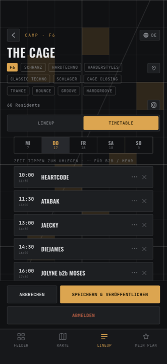

---
search:
  exclude: true
---

# Timetable bearbeiten

Der Reiter **Timetable** auf eurem Camp. Von oben nach unten:

1. **Tages-Reiter** MI DO FR SA SO, mit der Anzahl besetzter Slots darunter.
2. **Eine Hinweiszeile** — normalerweise *Zeit tippen zum Umlegen · ⋯ für B2B /
   mehr*. Sobald ihr einen Slot auswählt, wird sie bernstein und liest
   *Wähle einen Künstler für den markierten Slot ↓*.
3. **Die Slots des Tages**, nach Uhrzeit, darunter **＋ SLOT HINZUFÜGEN**.
4. **Euer Roster** — `Roster · 8 verfügbar` mit Suchfeld und einem Chip pro DJ,
   der an diesem Tag noch nicht eingeplant ist.

<figure markdown>
  { .shot }
  <figcaption>Tages-Reiter, Slots des Tages, darunter euer Roster.</figcaption>
</figure>

## Eine Slot-Karte lesen

| Stelle | Bedeutung |
| --- | --- |
| **Links** | Anfangszeit groß, Endzeit klein. **Antippen öffnet den Verschieben-Dialog.** |
| **Mitte** | Wer spielt (`NINA`, oder `NINA b2b CAROL`). Ist der Slot frei: *Offen · zum Buchen tippen*. |
| **Rechts ⋯** | Öffnet das Menü mit allen Aktionen für dieses Set. |
| **Rechts ✕** | Nur bei besetzten Slots: macht den Slot wieder frei. **Ohne Rückfrage.** |
| **Kartenkörper** | Antippen wählt den Slot aus (bernsteinfarbener Rand). |

Ein als No-Show markiertes Set ist blass und trägt ein rostrotes **NO-SHOW**.

## Einen Slot besetzen

1. Tag wählen.
2. Den Slot **antippen** — er leuchtet auf.
3. Jetzt entweder
      - **einen Roster-Chip antippen**, oder
      - **einen Namen ins Suchfeld tippen** und die Eingabetaste drücken bzw.
        den bernsteinfarbenen **＋ NAME**-Chip antippen.

!!! tip "Freie Namen sind erlaubt"

    Ihr müsst niemanden vorher ins Roster eintragen. Tippt den Namen einfach in
    das Suchfeld — beim Veröffentlichen wandert er automatisch in euer Lineup.

Die Roster-Chips sind blass und reagieren nicht, **solange kein Slot ausgewählt
ist**. Das ist kein Fehler — erst der Slot, dann die Person.

## Wer spielt tauschen

**⋯ → KÜNSTLER TAUSCHEN** öffnet die Auswahl mit Suchfeld. Ein ★ markiert, wer
gerade drauf steht.

Wählt ihr jemanden, der **an diesem Camp schon ein anderes Set hat**, fragt die
App nach, statt ihn doppelt einzutragen:

> **NINA SPIELT SCHON**
> Slots tauschen oder zweites Set hinzufügen
>
> · Tauschen mit SA 19:30–21:00
> · Als 2. Set hinzufügen

**Tauschen** ist ein echter Tausch: die beiden Sets tauschen ihre Besetzung,
jedes behält seine eigene Zeit.

## Verschieben — Zeit & Tag

Erreichbar über die **Zeit links auf der Karte** oder **⋯ → VERSCHIEBEN — ZEIT
& TAG**.

Das Formular hat vier Teile:

| Feld | Auswahl |
| --- | --- |
| **TAG** | MI DO FR SA SO |
| **START** | 18:00 · 19:30 · 21:00 · 22:30 · 00:00 · 01:30 · 03:00 · 04:30 · 06:00 |
| **EIGENE** | Freie Uhrzeit als `HH:MM`. Der Doppelpunkt kommt von selbst — tippt einfach `2015`. |
| **LÄNGE · ENDET 22:30** | 1h · 1h30 · 2h · 2h30 · 3h, oder eigene Minuten (mindestens 15, wird auf 15er gerundet). |

!!! warning "Ohne ÜBERNEHMEN passiert nichts"

    Das Formular ändert erst etwas, wenn ihr unten **ÜBERNEHMEN** tippt.
    Schließt ihr es vorher, ist die Eingabe weg. Das ist der häufigste
    Stolperstein.

    Eine ungültige Uhrzeit wird nicht gemeldet — das Feld bekommt nur einen
    roten Rand und der Wert wird ignoriert.

### Der Verschiebe-Hinweis

Steht im Formular ein rostroter Kasten

> ⚠ **Verschiebt 2 Set(s), um Platz zu machen**

dann kollidiert eure neue Zeit mit anderen Sets, und die rücken **nach hinten**.
Steht dort nichts, passt der Slot in eine Lücke und stört niemanden.

Beim **ÜBERNEHMEN** fragt die App dann noch einmal nach (*Sets verschieben?* →
**Weiter**).

Das verschobene Set bekommt **genau** die Zeit, die ihr gewählt habt. Alles
andere weicht aus, nie andersherum. Sets, die als No-Show markiert sind, werden
dabei übersprungen.

!!! note "Nach 00:00 ist spät, nicht früh"

    `01:30` liegt **nach** `22:30` — es ist dieselbe Nacht. Zeiten vor 07:00
    gehören zum Programm des Vortags.

## Weitere Aktionen im ⋯-Menü

| Aktion | Was passiert |
| --- | --- |
| **B2B-Partner hinzufügen** | Zweiter Name für denselben Slot. Anzeige: `NINA b2b CAROL`. Nur bei besetzten Slots. |
| **B2B-Partner entfernen** | Nimmt den zweiten Namen wieder raus. |
| **Als No-Show markieren** | Die Person kommt nicht. Der Slot wird blass und bekommt **NO-SHOW**. Löst beim Veröffentlichen eine Mitteilung aus. |
| **No-Show aufheben** | Zurücknehmen. Löst **ebenfalls** eine Mitteilung aus — die Leute wurden ja vorher anders informiert. |
| **Genres** | Mehrfachauswahl. **Das zuerst gewählte Genre ist das Hauptgenre** und bestimmt die Farbe. Jeder Tipp wirkt sofort; **‹ Zurück** führt zurück, es gibt kein OK. |
| **Slot entfernen** | Löscht den Slot ganz. **Ohne Rückfrage** — rückgängig nur über **ABBRECHEN** der ganzen Bearbeitung. |

## Einen Slot hinzufügen

**＋ SLOT HINZUFÜGEN** hängt einen neuen Slot **hinter das letzte Set des Tages**,
90 Minuten lang, unbesetzt. Ist der Tag noch leer, beginnt er um **18:00**.

Weil er immer hinten angehängt wird, kann er nie mit etwas kollidieren.
