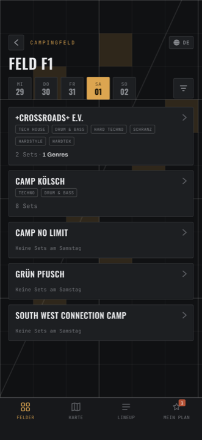

# Felder

Der Einstieg über die Struktur des Platzes: Feld → Camp → Set.

## Die Übersicht

Ganz oben drei Zahlen: wie viele **Camps**, **Felder** und **Sets** es insgesamt
gibt. Die sind bewusst absolut — sie ändern sich nicht, wenn du filterst.

Darunter ein zweispaltiges Raster mit einer Karte pro Feld: die Feld-Nummer
groß, rechts daneben `5 Camps`, und darunter bis zu drei Genre-Kürzel plus ein
`+N`, wenn das Feld mehr davon hat.

**Tippe eine Karte an** und du bist im Feld.

## Ein Feld

Oben eine Reihe Tages-Reiter — **MI DO FR SA SO** mit dem Datum darunter. Der
aktive ist bernstein gefüllt.

Darunter alle Camps des Feldes, untereinander. Pro Camp:

- der Name
- die Genres, für die das Camp steht
- eine Zeile für den **gewählten Tag**: `8 Sets · 3 Genres`, oder
  `Keine Sets am Freitag`, wenn dort nichts läuft

**Tippe ein Camp an** und du siehst dessen Programm.

!!! note "Der Tages-Reiter gilt überall"

    Der hier gewählte Tag ist derselbe, den auch andere Bildschirme benutzen.
    Er ist aber **nicht** dasselbe wie der Tag im Filter-Dialog — siehe
    [Filter & Suche](filter-und-suche.md#tag).

<figure markdown>
  { .shot }
  <figcaption>Tages-Reiter oben, darunter die Camps des Feldes.</figcaption>
</figure>

## Ein Camp

Oben angeheftet, scrollt nicht mit:

- ein bernsteinfarbenes **Feld-Abzeichen** — antippen bringt dich zurück ins Feld
- die Genres des Camps
- rechts ein kleines **Stecknadel-Symbol**: [auf der Karte zeigen](karte.md).
  Es trägt keine Beschriftung, ist aber genau das
- `12 Residents` — so viele DJs gehören zum Camp
- rechts daneben, falls vorhanden, ein **Instagram-Symbol**
- zwei Reiter: **Lineup** und **Timetable**

### Reiter „Timetable"

Das Programm des Camps für einen Tag, als Liste von Set-Zeilen. Eigene
Tages-Reiter, unabhängig von denen im Feld davor.

Blendet ein Genre-Filter hier Zeilen aus, erscheint ein Kasten
`4 durch Genre-Filter ausgeblendet` mit einem **Zurücksetzen** daneben — das
löscht **nur die Genres**, Tag und Feld bleiben gesetzt.

Ist an dem Tag nichts los: *Dieses Camp hat am Samstag keine Sets.*

### Reiter „Lineup"

Alle DJs des Camps als schlichte Liste mit Genre-Kürzel. Diese Zeilen sind
**nicht** antippbar — es ist eine Aufstellung, kein Programm. Für Zeiten:
Reiter *Timetable*.

Ist noch nichts eingetragen: *Noch keine DJs im Lineup.*

!!! tip "Welcher Reiter zuerst aufgeht, hängt vom Datum ab"

    Während des Festivals öffnet ein Camp direkt auf **Timetable** beim
    laufenden Tag. Außerhalb des Festivals öffnet es auf **Lineup**. Dasselbe
    Camp, zwei verschiedene Einstiege — das ist Absicht, überrascht aber beim
    ersten Mal.

## Was Filter hier tun

**Sie blenden nichts aus, sie dimmen.** Eine Karte, die nicht zu deinen Filtern
passt, wird blass — bleibt aber sichtbar *und* antippbar. Das Raster springt
dadurch nie um, und du siehst, was du gerade wegfilterst.

**Alle vier Filter wirken hier.** Wählst du einen Tag, wird ein Feld blass, auf
dem an diesem Tag kein Camp spielt — und die Genre-Prüfung läuft dann nur noch
gegen die Genres dieses Tages. Ein Camp, das Techno nur samstags spielt, lässt
sein Feld unter „Techno + Freitag" also nicht aufleuchten.

!!! note "Die Zahl auf der Karte ändert sich nicht"

    `5 Camps` ist immer die Gesamtzahl der Camps auf dem Feld, nie die Zahl der
    Treffer. Ein hell dargestelltes Feld kann also fünf Camps zeigen, von denen
    nur eines zu deinen Filtern passt.
