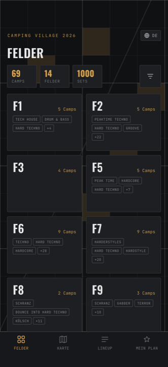

# Camping Village 2026

Die App zum Camping Village: **wer spielt wo und wann**, wo dein Camp auf dem
Platz liegt, und ein persönlicher Plan, der dich warnt, wenn du dich für zwei
Sets gleichzeitig entschieden hast.

Sie funktioniert auch, wenn das Netz auf dem Gelände wegbricht — einmal geladen,
bleiben die Daten auf dem Gerät.

<figure markdown>
  { .shot }
  <figcaption>Der Startbildschirm: alle Felder auf einen Blick.</figcaption>
</figure>

<video class="clip" src="assets/shots/tabs-rundgang.mp4" autoplay muted loop playsinline></video>

## Vier Tabs, mehr gibt es nicht

| Tab | Wofür |
| --- | --- |
| **Felder** | Alle Campingfelder, ihre Camps und deren Genres. Der Einstieg, wenn du weißt, wo du hin willst. |
| **Karte** | Die 3D-Karte des Geländes. Der Einstieg, wenn du *nicht* weißt, wo du hin willst. |
| **Lineup** | Wer gerade spielt, alle Künstler:innen, und die komplette Timetable als Raster. |
| **Mein Plan** | Deine mit ★ markierten Sets, nach Tagen sortiert, mit Warnung bei Überschneidungen. |

## Wenn du es eilig hast

1. **[Erste Schritte](erste-schritte.md)** — Sprache umstellen und Mitteilungen erlauben. Zwei Minuten.
2. **[Mein Plan](mein-plan.md)** — Sets markieren und dich rechtzeitig erinnern lassen. Das ist die Funktion, wegen der die App sich lohnt.
3. **[Karte](karte.md)** — Gesten und der eine Tipp-Trick, den die App selbst schlecht erklärt.

!!! tip "Ein Tag endet um 07:00, nicht um Mitternacht"

    Ein Set um 02:00 Uhr in der Nacht von Samstag auf Sonntag steht in der App
    unter **Samstag** — nicht unter Sonntag. Eine Festivalnacht bleibt so eine
    zusammenhängende Liste, statt am Datumswechsel zu zerreißen. Das gilt
    überall: in der Timetable, in deinem Plan und in den Erinnerungen.

## Bist du ein Camp?

Camps verwalten ihr eigenes Lineup direkt in der App. Den Zugang und die
Anleitung dazu bekommt ihr per Mail — der Bereich steht bewusst nicht in dieser
Navigation.
