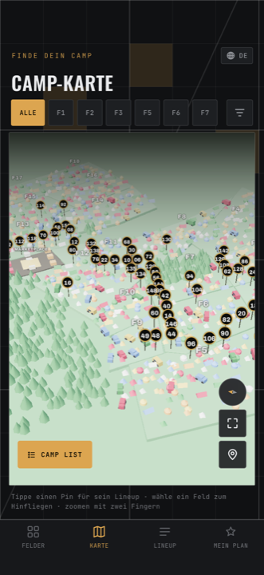

# Karte

Eine dreidimensionale Karte des Geländes mit einem Pin pro Camp. Sie liegt
komplett auf dem Gerät und funktioniert deshalb auch ohne Netz.

<figure markdown>
  { .shot }
  <figcaption>Feld-Chips oben, Karte in der Mitte, Hinweiszeile unten.</figcaption>
</figure>

## Gesten

| Geste | Wirkung |
| --- | --- |
| Ein Finger ziehen | Karte verschieben |
| Zwei Finger auf/zu | Zoomen |
| Zwei Finger drehen | Karte drehen |
| Zwei Finger hoch/runter | Neigung ändern — flacher oder steiler drauf |
| Tippen | Pin auswählen |

Beim Öffnen blendet die Karte diese Liste kurz selbst ein. Der Hinweis
**verschwindet nach sieben Sekunden und kommt nicht wieder** — deshalb steht er
hier.

Unten rechts, in der Karte selbst, sitzen vier Knöpfe: alles einpassen,
Pins ein-/ausblenden, ein **Kompass** (antippen richtet die Karte wieder nach
Norden aus) und **CAMP LIST**.

## Ein Camp finden

### Über einen Pin — zweimal tippen

!!! warning "Ein Pin braucht zwei Tipper"

    **Erster Tipp:** die Kamera fliegt zum Pin, er leuchtet auf, und unten
    erscheint eine Karteikarte mit Camp-Name, Feld, Genres und dem Knopf
    **LINEUP ANSEHEN →**.

    **Zweiter Tipp auf denselben Pin:** das Camp öffnet sich.

    Die Hinweiszeile der App sagt *„Tippe einen Pin für sein Lineup"* und
    unterschlägt damit den ersten Schritt. Wenn du nach dem ersten Tipp denkst,
    es sei nichts passiert: doch, schau nach unten.

Schneller geht es über den Knopf **LINEUP ANSEHEN →** auf der Karteikarte — der
öffnet direkt. Das **×** oben rechts schließt sie wieder.

### Über die Feld-Chips

Über der Karte eine Reihe: **ALLE**, dann ein Chip pro Feld.

- Ein Feld antippen → es wird bernstein, die Kamera rahmt das ganze Feld ein,
  und unten erscheint eine Reihe **Camp-Kurzwahlen**. Diese Kurzwahlen öffnen
  mit **einem** Tipp.
- Dasselbe Feld noch einmal antippen → Auswahl aufgehoben, Blick wieder aufs
  ganze Gelände. Das steht nirgends dran.
- **ALLE** tut dasselbe.

### Über die Camp-Liste

**CAMP LIST** unten rechts fährt eine Liste aller Camps hoch, mit Suchfeld. Du
kannst nach **Name**, nach **Feld** oder nach der **Camp-Nummer** suchen.

Ein Treffer fliegt hin und zeigt die Karteikarte — verhält sich also wie ein
*erster* Pin-Tipp. Zum Öffnen dann **LINEUP ANSEHEN →**.

## Von einem Camp zur Karte

Auf jedem Camp sitzt oben rechts ein kleines **Stecknadel-Symbol**. Antippen
wechselt zur Karte und fliegt direkt zu diesem Camp.

## Was Filter hier tun

Pins, die nicht passen, werden **stark abgedunkelt — aber nicht ausgeblendet**
und bleiben antippbar. Anders als auf der Feld-Übersicht wirken hier **alle
vier** Filter, auch der Tag.

Ist ein Filter aktiv, erscheint oben rechts in der Karte ein kleiner Chip mit
der Trefferzahl und **CLEAR**. Der räumt Genres, Felder, Tag und
„nur markierte" in einem Rutsch weg.

!!! note "Die Karte spricht Englisch"

    Die Bedienelemente *innerhalb* der Karte — der Einblend-Hinweis, **CAMP
    LIST** und dessen Suchfeld — sind derzeit nur auf Englisch, auch wenn die
    App auf Deutsch steht.

## Wenn die Karte leer bleibt

Zeigt der Kartenbereich nur ein leeres Rechteck, hat das Laden nicht geklappt.
Es gibt momentan **keine Fehlermeldung und keinen Wiederholen-Knopf** — hilft
nur: App ganz schließen und neu starten.
