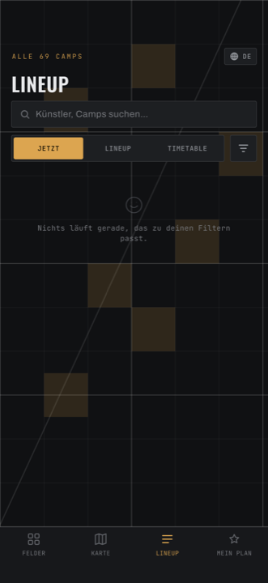
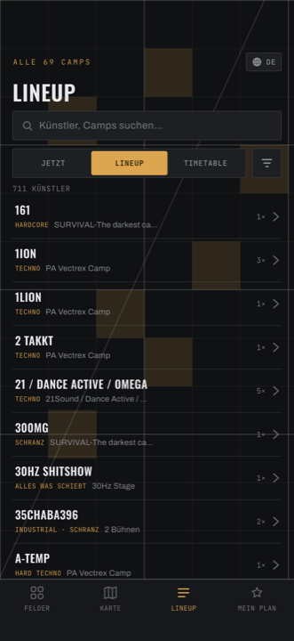
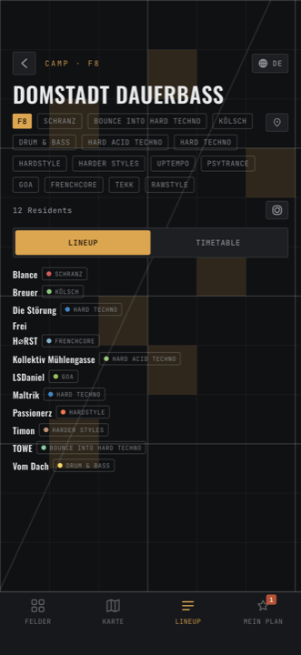
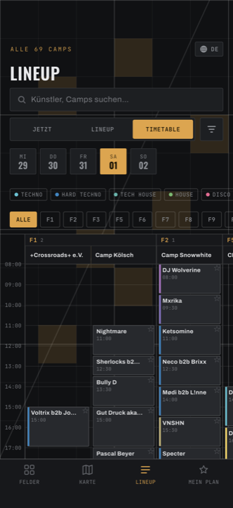

# Lineup

Das ganze Programm, aus drei Blickwinkeln. Oben ein Suchfeld
(*Künstler, Camps suchen…*), darunter ein Umschalter mit drei Feldern:

**JETZT · LINEUP · TIMETABLE**

Suchbegriff und Filter bleiben erhalten, wenn du zwischen den drei wechselst.

## Jetzt

<figure markdown>
  { .shot }
  <figcaption>Was gerade läuft, und was als Nächstes kommt.</figcaption>
</figure>

Oben ein pulsierender Punkt und **JETZT LIVE · Samstag 01:30**. Darunter zwei
Blöcke:

- **Läuft gerade** — jedes Set, das in diesem Moment spielt. Bernsteinfarbene
  Leiste links, und darunter ein dünner Balken, der langsam leerläuft: so viel
  ist von dem Set noch übrig.
- **Als Nächstes** — was danach kommt, höchstens 14 Einträge.

Passt nichts: *Nichts läuft gerade, das zu deinen Filtern passt.* bzw.
*Keine kommenden Sets passen.*

Abgesagte Sets (No-Show) tauchen hier nicht auf.

## Lineup

Ein reines Verzeichnis aller Künstler:innen — **ohne Zeiten**. Oben
`312 KÜNSTLER`, darunter eine Zeile pro Person: Name, bis zu zwei Genres, das
Camp (oder `3 Bühnen`, wenn sie an mehreren spielen) und wie viele Sets sie
haben.

<figure markdown>
  { .shot }
  <figcaption>Alle Künstler:innen, ohne Zeiten — zum Nachschlagen.</figcaption>
</figure>

Das Suchfeld greift hier auf Name, Genres **und** Camp-Namen.

Passt nichts: *Keine Künstler passen zu deiner Suche.*

**Tippe eine Zeile an** für die Detailseite: alle Sets nach Tagen gruppiert, mit
Zeit, Camp und Feld. Steht unter einem Set **b2b Name**, spielen zwei zusammen —
und die Seite nennt dir immer die *andere* Person. Rechts an jeder Zeile ein ★.

<figure markdown>
  { .shot }
  <figcaption>Alle Sets nach Tagen, mit Zeit, Camp und Feld.</figcaption>
</figure>

Ein Tipp auf so eine Zeile führt zum **Camp**, nicht zum Set.

## Timetable

<figure markdown>
  { .shot }
  <figcaption>Zeit läuft nach unten, jede Spalte ist ein Camp.</figcaption>
</figure>

Das komplette Programm eines Tages als Raster.

- **Die Zeit läuft nach unten.** Die Zeitleiste links bleibt beim seitlichen
  Scrollen stehen.
- **Jede Spalte ist ein Camp**, die Spalten sind nach Feldern gruppiert.
- Ganz oben eine **Genre-Legende** — die farbigen Punkte sind Schnellfilter, sie
  schalten dieselben Genres wie der Filter-Dialog.
- Darunter Feld-Chips mit **ALLE**.
- Unten steht, was du gerade siehst: `3 Felder · 27 Bühnen · scrollen zum Erkunden`.

Jeder Block trägt links einen farbigen Streifen in der Farbe seines
Hauptgenres, oben rechts ein **★**, und wenn das Set gerade läuft, füllt sich
der Block von unten bernstein — wie eine Sanduhr, die anzeigt, wie viel noch
übrig ist.

**Block antippen** → Künstler:in. **Spaltenkopf antippen** → Camp.

Eine rostrote **JETZT**-Linie markiert die aktuelle Uhrzeit.

Passt nichts: *An diesem Tag passen keine Sets zu deinen Filtern.*

!!! note "Warum das Raster bei 08:00 beginnt"

    Das Raster zeigt einen kompletten Festivaltag von 08:00 bis 08:00 am
    nächsten Morgen. Ein Set um 02:00 sitzt also **unten** in der Spalte, nicht
    oben — es gehört zur Nacht des vorigen Tages. Siehe der Kasten auf der
    [Startseite](index.md).
