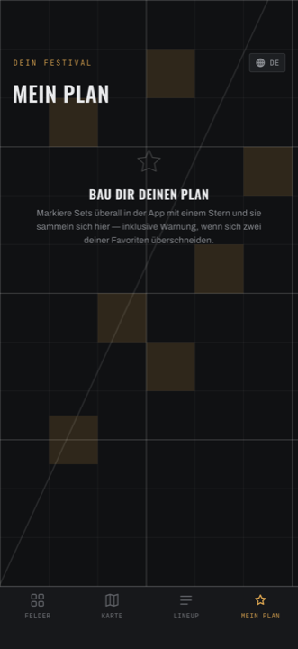
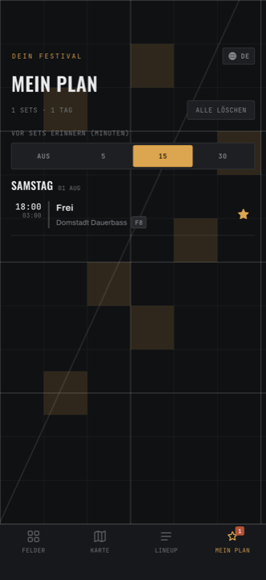

# Mein Plan

Deine Auswahl, nach Tagen sortiert — und eine Warnung, wenn du dich für zwei
Sets zur selben Zeit entschieden hast.

## Ein Set merken

Überall, wo ein Set steht, sitzt rechts ein **★**. Antippen füllt ihn
bernstein, und das Set liegt in deinem Plan. Nochmal antippen nimmt es wieder
raus.

Das geht in **Jetzt**, in der **Timetable**, auf einer **Künstler:innen-Seite**,
in der **Timetable eines Camps** — und in *Mein Plan* selbst.

Die Zahl am Stern-Symbol in der Tab-Leiste zählt sofort mit.

!!! tip "Beim ersten Stern fragt die App nach Mitteilungen"

    Markierst du dein allererstes Set, kommt die Frage *Auf dem Laufenden
    bleiben?*. Erlaubst du es, bekommst du Erinnerungen und wirst informiert,
    wenn ein Camp genau dieses Set verschiebt oder absagt.

## Der Plan

Ganz oben eine Zusammenfassung: `12 SETS · 3 TAGE`. Steht darunter eine rostrote
Zeile mit **⚠**, hast du Überschneidungen.

Darunter deine Sets, gruppiert nach Tag (`SAMSTAG 01 AUG`), innerhalb eines
Tages nach Uhrzeit.

<figure markdown>
  { .shot }
  <figcaption>So sieht der Plan aus, bevor du etwas markiert hast.</figcaption>
</figure>

Ist noch nichts markiert:

> **Bau dir deinen Plan**
> Markiere Sets überall in der App mit einem Stern und sie sammeln sich hier —
> inklusive Warnung, wenn sich zwei deiner Favoriten überschneiden.

<figure markdown>
  { .shot }
  <figcaption>Markierte Sets, nach Tagen gruppiert.</figcaption>
</figure>

## Überschneidungen

Überlappen sich zwei markierte Sets zeitlich, bekommt **jede betroffene Zeile**
ein rostrotes **⚠ KONFLIKT**, und oben steht, wie viele es sind.

Zwei Sets, die direkt aneinander anschließen — eines endet 22:30, das nächste
beginnt 22:30 — gelten **nicht** als Konflikt. Du musst nur laufen.

!!! warning "Die Zahl oben ist eine Untergrenze"

    Überschneiden sich **drei oder mehr** Sets gegenseitig, zählt die
    Kopfzeile zu niedrig — bei drei Sets steht dort `1 Überschneidung zu lösen`.

    Die **⚠ KONFLIKT**-Markierungen an den Zeilen sind dagegen immer
    vollständig. Verlass dich auf die Zeilen, nicht auf die Zahl. Und: die
    Warnung verschwindet erst, wenn wirklich kein Konflikt mehr da ist — ein
    falsches „alles gut" gibt es nicht.

## Erinnerungen

Unter der Liste steht **VOR SETS ERINNERN (MINUTEN)** und ein Umschalter:

**AUS · 5 · 15 · 30**

Voreingestellt sind **15** Minuten. Du bekommst dann kurz vorher eine
Mitteilung: *NINA startet bald*.

!!! note "„Aus" schaltet nur die Erinnerungen ab"

    Auf **Aus** wird keine Erinnerung mehr geplant. Meldungen darüber, dass ein
    Camp eines deiner markierten Sets **verschoben oder abgesagt** hat, kommen
    trotzdem — genau wie Wetter- und Sicherheitshinweise. Das ist Absicht.

Hast du Mitteilungen noch nie erlaubt, steht hier zusätzlich
**🔔 Mitteilungen aktivieren**.

## Alles löschen

Der Knopf **ALLE LÖSCHEN** fragt erst nach:

> **Plan löschen?**
> Damit werden alle 12 markierten Sets aus deinem Plan entfernt. Das lässt sich
> nicht rückgängig machen.
>
> [ Abbrechen ] [ **Alle löschen** ]

Erst **Alle löschen** räumt wirklich auf.

!!! warning "Nach dem Löschen kann der Lineup-Tab leer wirken"

    Hattest du den Filter **Nur markierte Sets** an und löschst dann deinen
    ganzen Plan, bleibt der Filter aktiv — mit null markierten Sets. Der
    Lineup-Tab ist dann komplett leer, und der Schalter im Filter-Dialog ist
    ausgegraut und lässt sich nicht ausschalten.

    **Ausweg:** Filter öffnen, oben **ZURÜCKSETZEN**. Das räumt allerdings auch
    Genre, Feld und Tag mit weg.

    Bekannter Fehler. Nimmst du dagegen deinen *letzten Stern* einzeln zurück,
    schaltet die App den Filter von selbst ab — nur beim Rundum-Löschen nicht.
